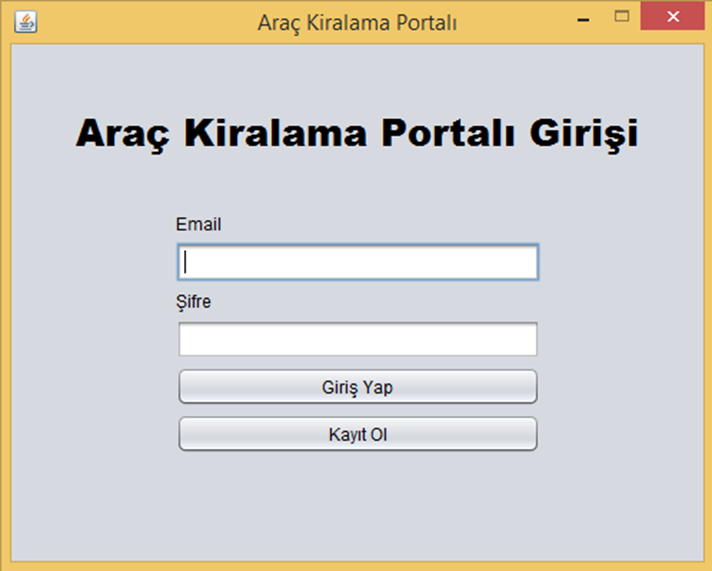
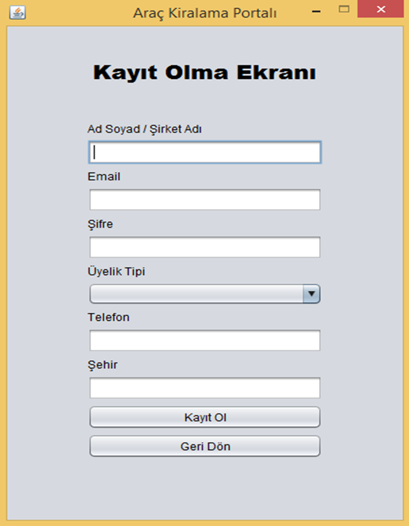
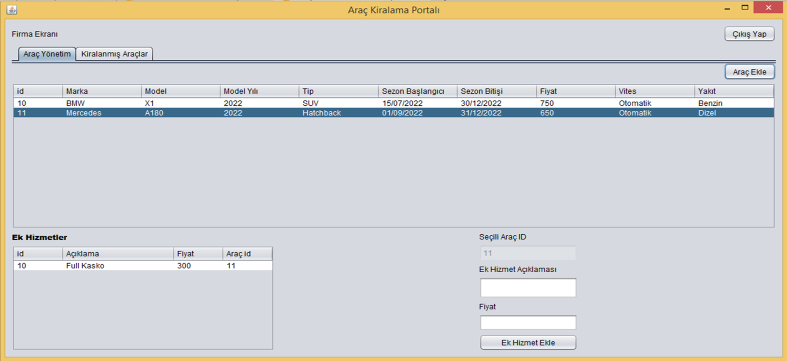
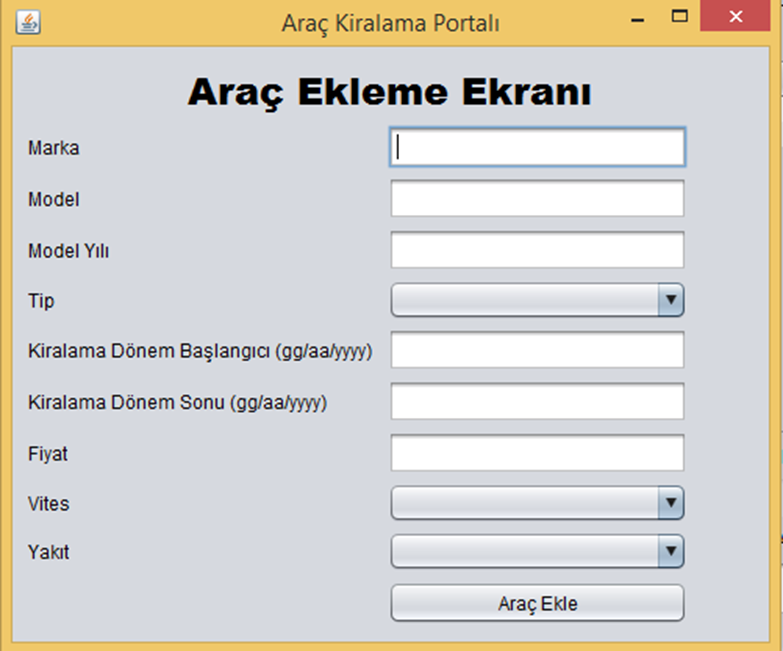
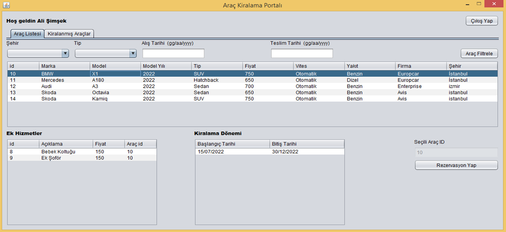
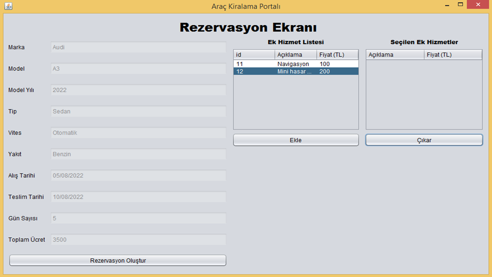

# Araç Kiralama Sistemi

Firmalar sisteme kayıt olup kiralamaya açık araçlarını kaydedir. Müşterileri de sisteme kaydolup müsait kiralık araçları filtreleyip kendisi için uygun olanı reverve eder.

## Kullanılan Teknolojiler

<code></code>
<code></code>
<code></code>
<code></code>
<code></code>

## Özellikler

- Projede swing gui kullanılmıştır.
- Sisteme araç kiralayan firmalar kaydedilir.  
- Firmalar bulundukları şehri sisteme girer.  
- Firmalar kendilerine ait araçları sisteme kaydedebilir.  
  - Araçların günlük fiyatları ve fiyatların geçerli olduğu tarih aralıkları,  
  - Aracın tipi (binek, arazi , ticari araçlar vs.),  
  - Hangi tarihlerde müsait oldukları,
  - Varsa ek hizmetleri ve fiyatları tanımlanır.  
- Kullanıcılar sisteme kayıt olur.  
- Kullanıcılar sistemde şehirler üzerinden araç tipine ve tarihe göre uygun araçları listeleyebilir ve rezervasyon yapabilir.  
- Rezervasyon yapılan tarihte ilgili aracın müsait olması ve başka kiralama ile çakışmaması kontrol edilir.  
- Firmalar ve kullanıcılar yaptıkları rezervasyonları listeleyebilir.  
- Rezervasyonlar en erken 1 gün öncesinden iptal edilebilir.

## Ekran Görüntüleri
- Sign up ve Sign in ekranları
  
  
  

- Firma ana ekranı
  
  

- Araç ekleme ekranı
  
  

- Kullanıcı ana ekranı
  
  

- Araç rezervasyon ekranı
  

## Kurulum
1. Projeyi klonlayın.
    - https://github.com/alisimsekk/Car_Rental_Project.git
2. `src/com/helper/Config` sınıfında veri tabanı konfigürasyonunu yapın.
3. Projeyi ayağa kaldırmak için ideden start edin.

## Ortam Değişkenleri

Bu projeyi çalıştırmak için aşağıdaki ortam değişkenlerini Config sınıfından değiştirmelisiniz.

String DB_URL  
String DB_USERNAME  
String DB_PASSWORD

## Lisans

[MIT](https://choosealicense.com/licenses/mit/)